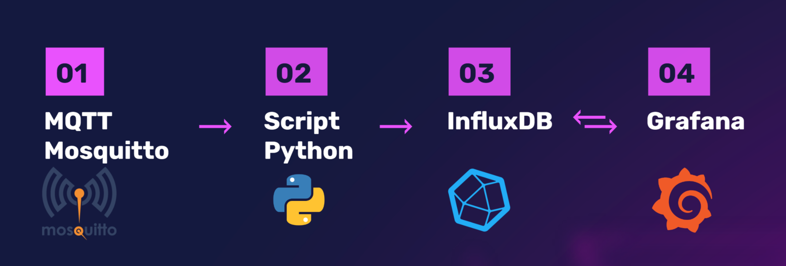
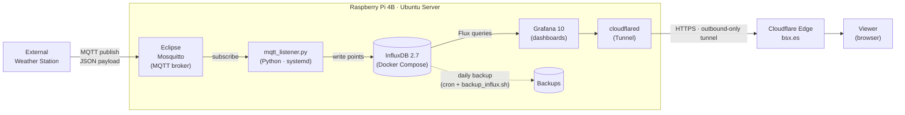

<!-- ============================================================
  BEFORE PUBLISHING: search for "TODO" and fill in or delete each one.
  Only keep numbers and claims you can explain in an interview.
============================================================ -->

<div align="center">

# weather-station-iot

### Real-time meteorological data acquisition, storage and visualization

*Bachelor's Thesis · Telecommunication Technologies Engineering (Telematics) · University of Valladolid*


</div>

---

## Table of Contents

1. [Project Overview](#-project-overview)
2. [Architecture & Data Flow](#-architecture--data-flow)
3. [Core Components](#-core-components)
4. [Payload Format](#-payload-format)
5. [Repository Structure](#-repository-structure)
6. [Configuration Examples](#-configuration-examples)
7. [Secure Remote Access](#-secure-remote-access)
8. [Validation & Load Testing](#-validation--load-testing)
9. [Tech Stack](#-tech-stack)
10. [Possible Improvements](#-possible-improvements)
11. [Author](#-author)

---

## Project Overview

`weather-station-iot` is an end-to-end system for **real-time meteorological data acquisition, storage and visualization**. It runs on a **Raspberry Pi 4B (4 GB RAM)** with **Ubuntu Server** as the central node.

The design is **modular and decoupled**: each stage of the pipeline (transport, processing, storage, visualization, access) is an independent component, combining **Docker containers** and **native system services**. Any stage can be restarted, replaced or scaled without touching the others.

**Key features**

- Lightweight publish/subscribe ingestion over **MQTT** (Eclipse Mosquitto)
- Python processing service with validation, key mapping and automatic reconnection, supervised by **systemd**
- **InfluxDB v2.7** time-series storage with **no retention limit** and **automated daily backups**
- **Grafana v10** dashboards built on **Flux** queries, exposed read-only through a `Viewer` account
- **HTTPS remote access through Cloudflare Tunnel** and a custom domain (`bsx.es`), with no router ports opened

<p align="center">
  
</p>

---

## Architecture & Data Flow



**Data flow, step by step**

| # | Stage | What happens |
|---|-------|--------------|
| 1 | **Acquisition** | The external weather station publishes JSON payloads with abbreviated metric keys to the MQTT broker. |
| 2 | **Transport** | Mosquitto receives the messages and distributes them to subscribers (pub/sub). |
| 3 | **Processing** | `mqtt_listener.py` subscribes, validates the input, decodes the JSON, maps short keys to descriptive names and adds a UTC timestamp. |
| 4 | **Storage** | The processed points are written to InfluxDB as time series. |
| 5 | **Visualization** | Grafana queries InfluxDB with Flux and renders real-time and historical dashboards. |
| 6 | **Access** | Cloudflare Tunnel publishes Grafana over HTTPS under `bsx.es`. |

---

## Core Components

### Hardware core: Raspberry Pi 4B

Central node of the system (4 GB RAM, Ubuntu Server). It hosts the broker, the processing service, the database, the dashboards and the tunnel client.

### MQTT broker: Eclipse Mosquitto

Lightweight publish/subscribe messaging. It handles incoming **JSON payloads with abbreviated sensor metrics** (`t`, `h`, `pn`, `v`, `a`, `pl`, `r`), which keeps messages small. See [Payload Format](#-payload-format).

* **Topic structure:** Messages are published under `/teleco/#` (specifically tested with `/teleco/estacion1`), allowing a scalable, hierarchical routing model for multiple stations.
* **Authentication:** Basic username and password validation configured on the broker to restrict unauthorized publishers.****

### Processing service: `mqtt_listener.py`

Python service built with **`paho-mqtt`** and **`influxdb-client`**. It is the bridge between the broker and the database.

- **Input validation** of every incoming message
- **JSON decoding** and mapping of short keys to descriptive field names
- **UTC timestamp generation** for every point
- **Infinite reconnection loop** to survive broker or database outages
- **Managed by `systemd`**: fault tolerance, automatic restart on failure and start on boot

### Time-series database: InfluxDB v2.7

Deployed with **Docker Compose**.

- **Infinite retention policy**: no time limit, so the full history is kept
- **Automated daily backups** with a shell script (`backup_influx.sh`) scheduled through `cron`

### Visualization: Grafana v10

- Custom dashboards using **Flux queries**
- **Advanced transformations**, such as `Join by field` to merge the time series of several sensors into a **single real-time table**
- **Historical window** limited to the **last 288 values**, which represents 24 hours
- Public access through a dedicated account with the **`Viewer` role** (read-only)

**Key panels included:**
* **Temperature:** Time-series graph showing values in °C.
* **Relative Humidity:** Time-series graph showing percentage values (%).
* **Atmospheric Pressure:** Time-series graph showing hPa.
* **Wind Speed & Direction:** Real-time graphs for anemometer (m/s) and veleta (°).
* **Precipitation:** Accumulated rainfall tracking (mm).
* **Solar Radiation:** UV index / radiation tracking (W/m²).
* **Latest Values Table:** Combined table view utilizing `Join by field` transformations to show all current sensor metrics at a glance.

### Secure access: Cloudflare Tunnel

Cloudflare Tunnel maps the dashboard to a custom domain (`bsx.es`). Details in [Secure Remote Access](#-secure-remote-access).

---

## Payload Format

Stations publish compact JSON messages. Short keys keep the payload small; the listener translates them into descriptive field names before storage.

```json
{ "t": 22.5, "h": 56.7, "pn": 1012, "v": 90, "a": 4.1, "pl": 0.0, "r": 510 }
```


| Key | Stored as | Unit |
| :--- | :--- | :--- |
| **t** | temperatura | °C |
| **h** | humedad | % |
| **pn** | presion | hPa |
| **v** | veleta | ° (degrees) |
| **a** | anemometro | m/s |
| **pl** | pluviometro | mm |
| **r** | radiacion | W/m² |

---

## Repository Structure


```text
weather-station-iot/
├── README.md
├── architecture.png          # System architecture and data flow diagram
├── docker-compose.yml        # Mosquitto, InfluxDB and Grafana container orchestration
├── mqtt_listener.py          # Python MQTT client and InfluxDB writer service
├── mqtt_listener.service     # systemd unit for automatic background execution
└── backup_influx.sh          # Daily InfluxDB automated backup script
```

---

## Configuration Examples

### systemd unit (`mqtt_listener.service`)

```ini
[Unit]
Description=MQTT to InfluxDB listener
After=network-online.target mosquitto.service docker.service
Wants=network-online.target

[Service]
Type=simple
User=teleco
WorkingDirectory=/home/teleco/estacion-meteorologica
ExecStart=/usr/bin/python3 /home/teleco/estacion-meteorologica/scripts/mqtt_listener.py
Restart=always
RestartSec=5

[Install]
WantedBy=multi-user.target
```

```bash
sudo systemctl daemon-reload
sudo systemctl enable --now mqtt_listener.service
```

### Daily backup (`cron`)

```cron
# Every day at 02:00
0 2 * * * /home/teleco/estacion-meteorologica/scripts/backup_influx.sh >> /var/log/backup_influx.log 2>&1
```

### Grafana panel (Flux)

```flux
from(bucket: "estacion1")
  |> range(start: -24h)
  |> filter(fn: (r) => r._measurement == "mediciones")
  |> filter(fn: (r) => r._field == "temperatura")
  |> limit(n: 288)
```

---

## Secure Remote Access

The system is published through a **Cloudflare Tunnel** mapped to the custom domain **`bsx.es`**.

- **No open router ports and no port forwarding.** `cloudflared` creates an **outbound-only** connection to Cloudflare.
- **Works behind restrictive networks.** The project had to deal with the university's NAT and firewall constraints, which made classic port forwarding impractical.
- **HTTPS** to the end user, served through Cloudflare.
- **Least privilege:** public visitors use a dedicated Grafana account with the `Viewer` role (no editing or administration).

---

## Validation & Load Testing

The system was validated in three steps:

1. **Basic MQTT communication:** end-to-end publish → broker → listener → database → dashboard.
2. **Synthetic signal simulation:** **sine and cosine waves** published as sensor data, to verify mapping, storage and visualization against a known, predictable signal.
3. **Load test:** **Telegraf** and a **simulator script** generated continuous traffic **equivalent to more than 6,000 concurrent weather stations**. The system handled it **without performance degradation**.

| Metric | Value |
| :--- | :--- |
| **Messages per second** | 20 msg/s (equivalent to ~6,060 stations sending data every 5 minutes)[cite: 4] |
| **CPU usage (Raspberry Pi)** | Controlled spikes from a 10% baseline up to 25-30%[cite: 4] |
| **RAM usage (Raspberry Pi)** | Highly stable, never exceeding 16.5% of total RAM[cite: 4] |
| **Test duration** | 5 minutes (structured in continuous traffic bursts and pauses)[cite: 4] |

---

## 🛠️ Tech Stack

| Layer | Technology |
|-------|------------|
| **Hardware** | Raspberry Pi 4B (4 GB) |
| **OS** | Linux · Ubuntu Server |
| **Messaging** | MQTT · Eclipse Mosquitto |
| **Processing** | Python · `paho-mqtt` · `influxdb-client` |
| **Storage** | InfluxDB v2.7 |
| **Visualization** | Grafana v10 · Flux |
| **Containers** | Docker · Docker Compose |
| **Service management** | systemd · cron · Bash |
| **Remote access** | Cloudflare Tunnel · custom domain |
| **Testing** | Telegraf · Python simulator |

---


## Possible Improvements

Ideas to take the system further:

- Authentication, ACLs and TLS on the MQTT broker
- Alerting in Grafana (thresholds, notifications)
- Downsampling with InfluxDB tasks for long-term history
- Support for industrial protocols (Modbus, OPC UA) through a gateway
- Monitoring of the system itself (broker, listener, resources)

---

## Author

**Andrés Espinel López**
Telecommunications Engineer (Telematics) · University of Valladolid

[](https://www.linkedin.com/in/andres-espinel-teleco/)
[](mailto:espinellopezandres@gmail.com)

---

<div align="center">

*Built as a Bachelor's Thesis · Universidad de Valladolid*

</div>
